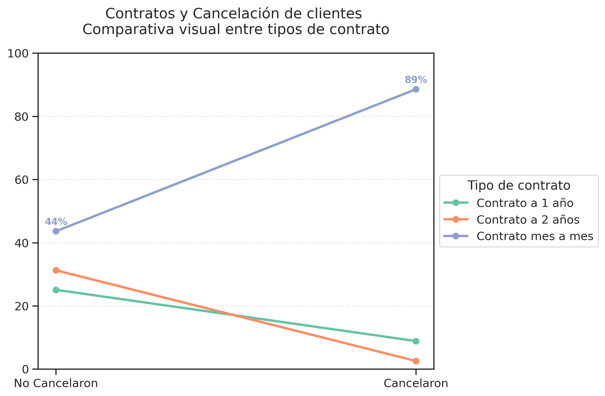
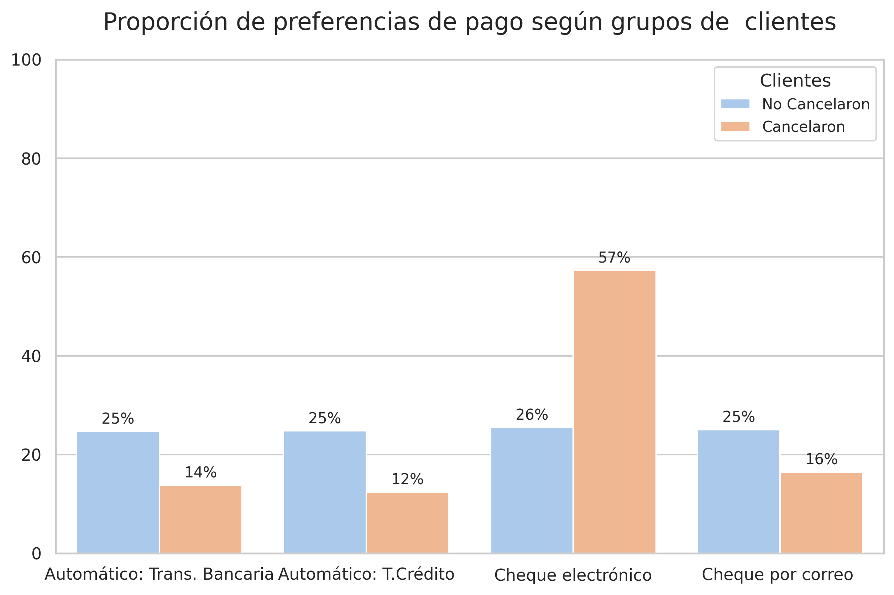
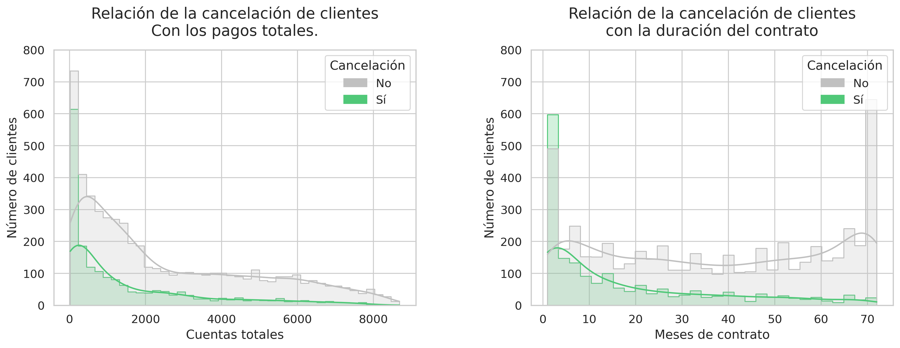
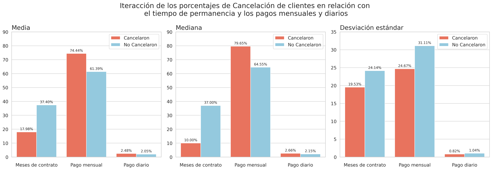
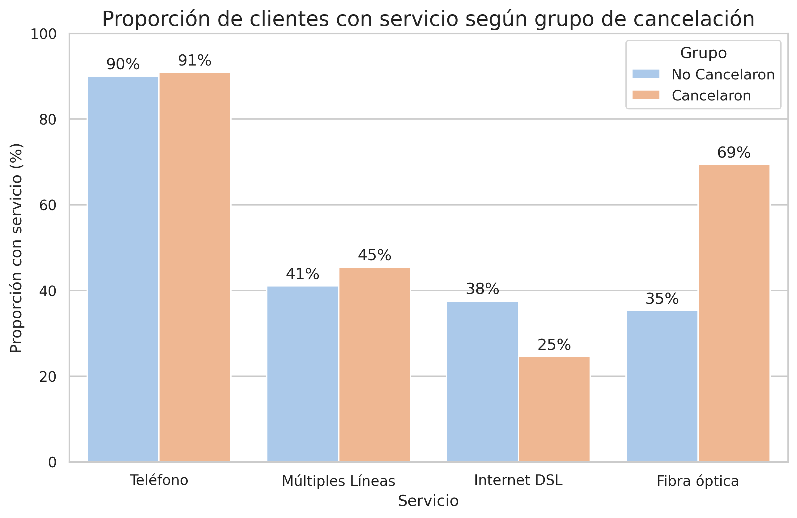
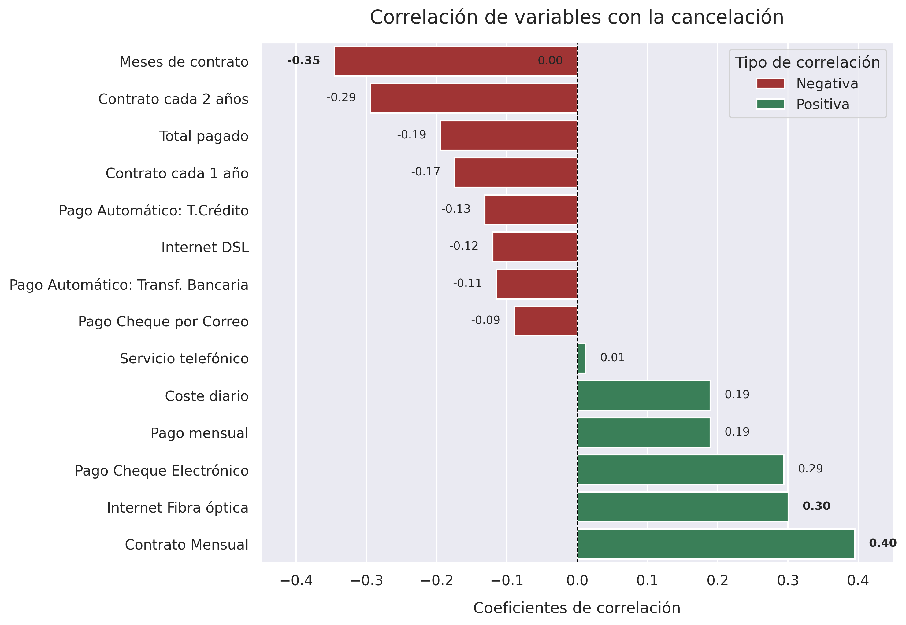
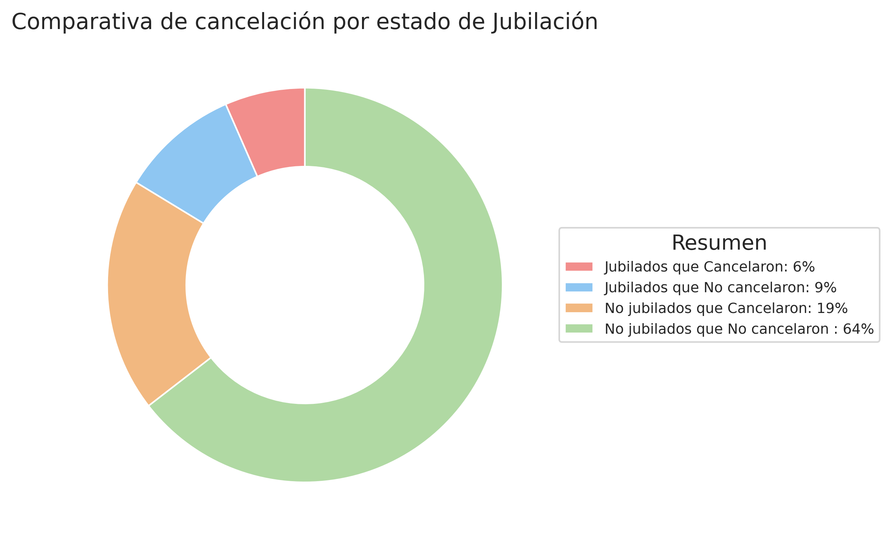
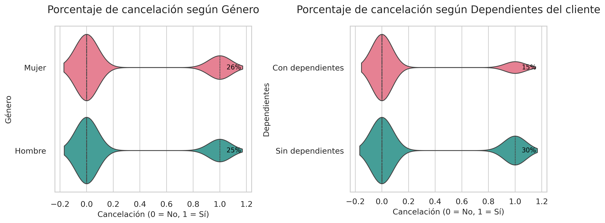

# 📡 **TelecomX Challenge - Análisis de Cancelación de Clientes (Churn)**

Este proyecto tiene como objetivo analizar los factores determinantes del churn en una compañía de telecomunicaciones mediante técnicas de análisis exploratorio de datos, visualización estadística y modelado. El propósito es identificar patrones significativos y variables predictoras asociadas a la cancelación del servicio, con el fin de diseñar estrategias basadas en datos que contribuyan a reducir la tasa de pérdida de clientes y fortalecer su fidelización.

## 🧰 **Herramientas Utilizadas**

🔸 **Python**  
🔸 **Pandas** y **NumPy** para manipulación de datos  
🔸 **Seaborn** y **Matplotlib** para visualización  
🔸 **Google Colab** como entorno de desarrollo  
🔸 **GitHub** y **Markdown** para documentación

## 📌 **Objetivos**

🔍 Analizar la tasa de cancelación de clientes mediante métricas descriptivas y segmentación temporal, con el objetivo de cuantificar su magnitud y evolución.

📊 Examinar la relación entre variables demográficas, contractuales y financieras utilizando técnicas estadísticas (como análisis de correlación, pruebas de hipótesis y modelos predictivos) para identificar factores asociados al churn.

🧠 Detectar perfiles de alto riesgo de cancelación mediante análisis multivariado y algoritmos de clasificación, permitiendo una segmentación precisa de clientes según su propensión al abandono.

📌 Generar recomendaciones basadas en datos orientadas a la retención, mediante la interpretación de patrones identificados y la simulación de escenarios de intervención.

## 📊 **Resultados Clave**

- ###El análisis muestra una correlación positiva entre la modalidad de contrato mensual y la tasa de cancelación, indicando un mayor riesgo de churn en este grupo.
  

- ###Dentro del modelo de predicción de churn, el método de pago mediante cheque electrónico muestra un coeficiente positivo, lo que sugiere un impacto directo en el aumento de la probabilidad de abandono del servicio.
  

- ###Los clientes que cancelan suelen presentar menor antigüedad y bajo gasto acumulado, reflejo de una permanencia limitada en el servicio.

- ###Un mayor gasto mensual combinado con baja antigüedad se asocia con una mayor probabilidad de cancelación, lo que sugiere que los clientes con tarifas elevadas y poca fidelización tienden a abandonar el servicio dentro del primer año.
  

- ###El uso de fibra óptica se asocia con una mayor tasa de cancelación en comparación con el servicio DSL.
  

- ###Combinaciones específicas de variables incrementan la precisión en la predicción del riesgo de cancelación.
  

- ###Tipos de clientes: Edad, género y dependientes a cargo.
  

## 🔧 **Recomendaciones**

🧭 Promover contratos de mayor duración mediante incentivos, para reducir la probabilidad de churn.

💳 Fomentar métodos de pago automáticos, asociados con menor tasa de cancelación.

📉 Monitorear clientes con alto costo mensual o diario, dada su mayor propensión al abandono.

🎯 Ofrecer beneficios por permanencia o tarifas decrecientes para reforzar la fidelización.

🔌 Optimizar los planes de fibra óptica con mejoras en valor percibido y soporte, dada su asociación con mayor churn.

🧬 Aplicar segmentación de riesgo para personalizar estrategias de retención.

🚨 Implementar alertas tempranas basadas en patrones de comportamiento predictivos de cancelación.

###**✍️Creado por: Jeison Velasco**

